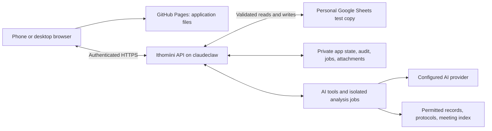

# GitHub Pages and claudeclaw

Updated 25 September 2026. The preferred direction is the user's proposed GitHub Pages frontend with a separate backend and chatbot on the existing claudeclaw server. No new service has been deployed.

SSH is for administration and deployment. The browser calls an HTTPS API; it does not connect through SSH. The backend can handle Google access and coordinated saves as well as chat, so a second Apps Script service is no longer the main proposal.

## Server evidence

A read-only SSH check succeeded. The host reported 4 logical CPUs, 23 GiB total RAM with approximately 21 GiB available, and approximately 148 GiB free on its 193 GiB root disk. Caddy and the Tiputini app, earlier Hub, provider proxy, and media services were active. The public Tiputini catalogue returned HTTP 200. These observations support trying a small additional service; they are not a load-capacity guarantee.

Tiputini's deployment uses a private pinned Node runtime, Caddy for HTTPS, an app on loopback port 8792, and a provider proxy on loopback port 8793. The new app needs its own service, release directory, private state, credentials, analysis workspaces, logs, and HTTPS route or hostname. Analysis jobs need concurrency and resource limits to preserve the other applications' availability.

## Reuse and adaptation

Useful Tiputini components include chat threads, a results panel, saved charts/tables/maps, cancellable jobs, document retrieval, dictation, and isolated analysis workspaces. Review reusable provider adapters and personal-account connections explicitly. Hosting on the same machine does not give new users access to Tiputini accounts, records, or provider credentials.

The existing Hub frontend uses relative API paths. Its server uses a Secure, HttpOnly, SameSite=Strict cookie named `__Host-tiputini_session` and checks `TIPUTINI_ORIGIN`. Its current endpoints therefore cannot be called unchanged as the backend for a separate GitHub Pages origin.

Local evidence is in `/home/franz/Documents/Tiputini-datahub/app/deploy/README.md`, `apps/server/src/tiputini/accountHttp.ts`, `apps/server/src/tiputini/http.ts`, and `apps/web/src/tiputini/accountScope.ts` within that app checkout.

## Browser and hosting requirements

GitHub Pages from a private personal repository requires an eligible paid plan. Published Pages assets remain publicly reachable. Publish only built application assets, excluding private notes and workbook data. [GitHub documentation](https://docs.github.com/en/pages/getting-started-with-github-pages/creating-a-github-pages-site).

Configure authentication and CORS for the actual frontend origin. CORS is not user authorization. Project paths under one GitHub Pages hostname are not separate browser origins. [MDN CORS guide](https://developer.mozilla.org/en-US/docs/Web/HTTP/Guides/CORS).

Test mobile login, renewal, streaming responses, uploads, and reconnect behavior. Tiputini's strict same-site cookie cannot simply be reused for cross-site Pages requests. Frontend/API custom domains under one controlled site may simplify cookie handling; the domain and authentication mechanism remain implementation decisions. [MDN cookie guide](https://developer.mozilla.org/en-US/docs/Web/HTTP/Guides/Cookies).

## Data and operations

Google Sheets remains the biological record store during the trial. Every trial mutation targets the verified personal copy. The original workbook is excluded from the write allowlist. App-owned storage can hold accounts, drafts, tasks, chat, results, attachments, request IDs, and audit records. New scientific fields need an explicit storage decision rather than being hidden in free-text notes.

Forms and AI use the same named operations for collections, emergences, deaths, clutch observations, crosses, samples, and corrections. Each validates the selected records and permitted fields, preserves formulas, and returns a saved/pending/error result. AI and photo/voice entry can prepare edits with affected records and old/new values for review before applying them.

The backend can serialize its own ID allocations. Direct spreadsheet edits bypass that coordination, so stale rows and changed identifiers need detection and reconciliation. A local journal and Sheets writes are separate operations; retries and partial failures require recoverable state rather than an assumed cross-system transaction.

Offline drafts use a bounded permitted working set, show the last sync time, and retain provisional IDs until accepted. Analyses retain source versions, methods, filters, denominators, and uncertainty. The same access checks govern forms, search, chat, generated results, and attachments.

Apps Script remains an alternative for a narrower Sheets integration. Migrating the biological database is a separate decision and is not required just to combine Pages with this existing server.
